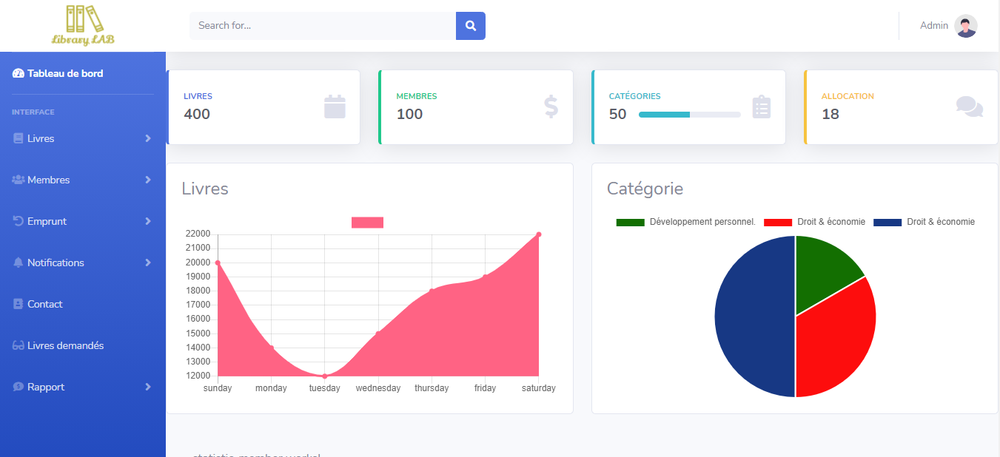

<p align="center">

</p>


## Introduction

Library Lab is a full-stack web application for managing a library — borrowing, cataloguing, member management, circulation tracking, and more. It includes a public-facing guest portal, a member OPAC portal, a staff admin panel, and a super-admin SaaS dashboard.

## Information
-   Status: Active development
-   Latest version: 1.1.0
-   Sector: Library Management / Education
-   Created: December 2020
-   Last updated: July 2026

## Table of contents
* [Documentation](#documentation)
* [Demo](#demo)
* [Screenshots](#screenshots)
* [Technologies](#technologies)
* [Setup](#setup)
* [Features](#features)
* [Project Structure](#project-structure)
* [Contact](#contact)
* [License](#license)

## Documentation
https://github.com/aniskchaou/LIBRARYLAB-FRONTEND-ADMIN/wiki

## Demo
https://library-lab.herokuapp.com/

## Screenshots
<p align="center">

<p>

## Technologies

**Frontend**
* Angular 13 (NgModule-based, standalone: false)
* TypeScript
* Bootstrap / custom CSS

**Backend**
* Spring Boot 2.5.5
* Java 8
* Spring Security + JWT authentication
* Spring Data JPA / Hibernate
* PostgreSQL

## Setup

### Prerequisites
- Node.js ≥ 14, npm
- Java 8 JDK
- PostgreSQL (running, with a database configured in `backend/src/main/resources/application.properties`)

### Frontend
```bash
npm install
npx ng serve
# App runs at http://localhost:4200
```

### Backend
```bash
cd backend
.\mvnw.cmd spring-boot:run
# API runs at http://localhost:9090
```

## Features

**Guest Portal** (public, no login required)
- Home / OPAC landing page
- About page
- Contact page
- New Arrivals — browse recently added books with date filters (7/30/60/90/180/365 days)
- Browse by Category — sidebar category list with filtered book grid
- FAQ — searchable accordion with 5 topic sections
- Member self-registration (3-step wizard)

**Member OPAC**
- Login, profile, borrowing history
- Book search and holds
- Chatbot assistant

**Admin Panel**
- Books, categories, authors, publishers management
- Circulation (checkout / check-in / renewals)
- Member management
- Reports and analytics
- Email notifications and reminders
- QR/barcode generation
- E-book management

**Super Admin (SaaS)**
- Multi-tenant organization management
- Subscription and billing (Stripe integration)
- Plan management and coupons
- API monitoring and audit logs
- User management across tenants

## Project Structure

```
LIBRARYLAB/
├── src/app/
│   ├── modules/
│   │   ├── guest/          # Public-facing pages (no auth)
│   │   ├── opac/           # Member portal
│   │   ├── admin/          # Library staff admin
│   │   ├── super-admin/    # SaaS super-admin dashboard
│   │   ├── memberr/        # Member CRUD
│   │   ├── chatbot/        # AI chat assistant
│   │   └── shared/         # Login, shared components
│   ├── main/
│   │   ├── models/         # TypeScript entity models
│   │   └── urls/           # API URL constants (CONFIG.URL_BASE)
│   └── app.module.ts       # Root module, all routes
├── backend/
│   └── src/main/java/com/dev/delta/
│       ├── controllers/    # REST API controllers
│       ├── entities/       # JPA entities
│       ├── repositories/   # Spring Data repositories
│       ├── services/       # Business logic
│       ├── security/       # JWT + Spring Security config
│       └── dto/            # Data transfer objects
└── src/environments/       # Angular environment configs
```

## Contact
contact@delta-dev-software.com

## License
<a href="license.txt">MIT License</a>
